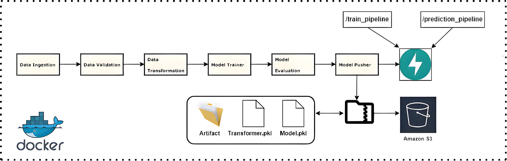
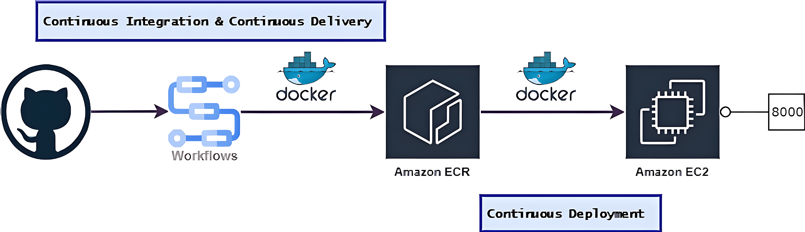

# Detection of APS Failure at Scania Trucks with Machine Learning.

## Table of Contents

- [Overview](#overview)
- [Dataset](#dataset)
- [Tech Stack & Infrastructure](#tech-stack--infrastructure)
- [Project Architecture](#project-architecture)
- [Deployment Architecture](#deployment-architecture)
- [Manual Steps to Run the Application](#manual-steps-to-run-the-application)
- [Run the Application on the Cloud - AWS Deployment Steps](#run-the-application-on-the-cloud---aws-deployment-steps)

## Overview

The Air Pressure System (APS) is a critical component of a heavy-duty vehicle that uses compressed air to force a piston that provides pressure to the brake pads, thus slowing the vehicle down. The benefits of using an APS instead of a hydraulic system are easy availability and long-term sustainability of natural air. It is a Binary Classification problem where the dataset's positive class consists of component failures for a specific component of the APS system. The negative class consists of trucks with failures for components unrelated to the APS.

## Dataset

APS Failure at Scania Trucks. (2017). UCI Machine Learning Repository. [https://doi.org/10.24432/C51S51](https://doi.org/10.24432/C51S51).

## Tech Stack & Infrastructure

1. Python
2. Machine Learning
3. FastAPI
4. MongoDB
5. Docker
6. GitHub Actions
7. AWS EC2, ECR & S3
8. Doppler

## Project Architecture



## Deployment Architecture



## Manual Steps to Run the Application

#### Step 1: Install the latest version of the [AWS CLI](https://docs.aws.amazon.com/cli/latest/userguide/getting-started-install.html).

```bash
curl "https://awscli.amazonaws.com/awscli-exe-linux-x86_64.zip" -o "awscliv2.zip"
unzip awscliv2.zip
sudo ./aws/install
```

#### Step 2: Setup [Doppler](https://www.doppler.com/) to securely store and manage credentials.

```bash
AWS_ACCESS_KEY_ID="XXXXXXXXXXXXXXXXXXXX"
AWS_REGION_NAME="ap-south-1"
AWS_SECRET_ACCESS_KEY="XXXXXXXXXXXXXXXXXXXXXXXXXXXXXXXXXXXXXXXX"
COLLECTION_NAME="aps"
DATABASE_NAME="sensordb"
MONGODB_URL_KEY="mongodb+srv://root:<db_password>@sensordb.rcw9e.mongodb.net/?retryWrites=true&w=majority&appName=sensordb"
PREDICTION_BUCKET_NAME="scania-sensor-inference"
TRAINING_BUCKET_NAME="scania-sensor-train"
```

#### Step 3: Create AWS S3 Buckets to store and manage artifacts.

```bash
scania-sensor-train/
│── artifact/
│── logs/
│── saved_models/

scania-sensor-inference/
│── inference_artifact/
```

#### Step 4: Containerize the Application using Docker.

```bash
docker build -t aps:latest .
```

#### Step 5: Run the Docker Image in the local system.

```bash
docker run -it --rm \
  -p 8000:8000 \
  -e AWS_ACCESS_KEY_ID=<AWS-ACCESS-KEY-ID> \
  -e AWS_SECRET_ACCESS_KEY=<AWS-SECRET-ACCESS-KEY> \
  -e AWS_REGION_NAME=<AWS-REGION-NAME> \
  -e DOPPLER_SERVICE_TOKEN=<DOPPLER-SERVICE-TOKEN> \
  aps:latest
```

## Run the Application on the Cloud - AWS Deployment Steps

1. Log in to the AWS console.
2. Create an IAM user for deployment.

   - **With specific permission:**
     1. **Amazon Elastic Compute Cloud (Amazon EC2):** AWS EC2 provides scalable computing capacity in the AWS Cloud and eliminates the need to invest in hardware. Hence, we can develop and deploy applications faster. EC2 can launch as many or as few virtual servers.
     2. **Amazon Elastic Container Registry (Amazon ECR):** AWS ECR is a secure, scalable, and reliable container image registry service. It supports private repositories with resource-based permissions. We use CLI to push, pull, and manage Docker images inside ECR.
     3. **Amazon Simple Storage Service (Amazon S3):** AWS S3 is an object storage service offering industry-leading scalability, data availability, security, and performance. We can store, organize, and protect data for virtually any use case, such as data lakes, cloud-native applications, and mobile apps.
   - **Description: About the deployment.**
     1. Build a Docker image of the source code.
     2. Push the Docker image to AWS ECR.
     3. Launch the AWS EC2 instance.
     4. Pull the Docker image from ECR to EC2.
     5. Launch the Docker image inside AWS EC2.
   - **Policy:**
     1. AmazonEC2ContainerRegistryFullAccess
     2. AmazonEC2FullAccess
     3. AmazonS3FullAccess

3. Generate the access keys for the IAM user.
4. Create the S3 Buckets to store project artifacts and log files.
5. Create an ECR repository to store/save the docker image.
6. Launch an EC2 virtual machine **(t2.medium)** with Ubuntu OS.
7. Connect the EC2 and install the Docker inside the EC2 machine.

   ```bash
   sudo apt-get update && sudo apt-get upgrade -y

   curl -fsSL https://get.docker.com -o get-docker.sh
   sudo sh get-docker.sh
   sudo usermod -aG docker ubuntu
   newgrp docker
   ```

8. Configure EC2 as a self-hosted runner.

   `setting > actions > runner > new self hosted runner > choose OS > then run command one by one`

9. Setup GitHub Actions Secrets.

   ```bash
   =========================================================================
   Paste the following credentials as GitHub Actions Secrets.
   =========================================================================

   AWS_ACCESS_KEY_ID=XXXXXXXXXXXXXXXXXXXX
   AWS_ECR_LOGIN_URI=339732480054.dkr.ecr.ap-south-1.amazonaws.com
   AWS_REGION=ap-south-1
   AWS_SECRET_ACCESS_KEY=XXXXXXXXXXXXXXXXXXXXXXXXXXXXXXXXXXXXXXXX
   DOPPLER_SERVICE_TOKEN=XX.XX.XXX.XXXXXXXXXXXXXXXXXXXXXXXXXXXXXXXXXXXXXXXXXXXXXX
   ECR_REPOSITORY_NAME=aps
   ```

10. Create a new EC2 Security Group (Inbound rules) to access port **8000**.

## Authors

- [Aritra Ganguly](https://in.linkedin.com/in/gangulyaritra)

## License & Copyright

[MIT License](LICENSE)
